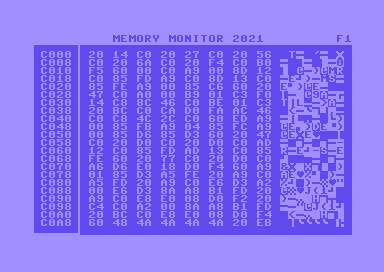

***[ Replaced by https://github.com/wardog1uk/MemMon3 ]***

# Memory Monitor 2021

Commodore 64 Memory Monitor written in assembly using [CBM prg Studio](https://www.ajordison.co.uk/).

[Download.](https://github.com/wardog1uk/MemMon2/releases/latest)

### Commands
* +/- move one byte up/down.
* Up/down move one line up/down
* Left/right move one page up/down.
* G to show go window. Enter hex characters for new address or space to skip.
* F1 to show help.
* Q to quit.
